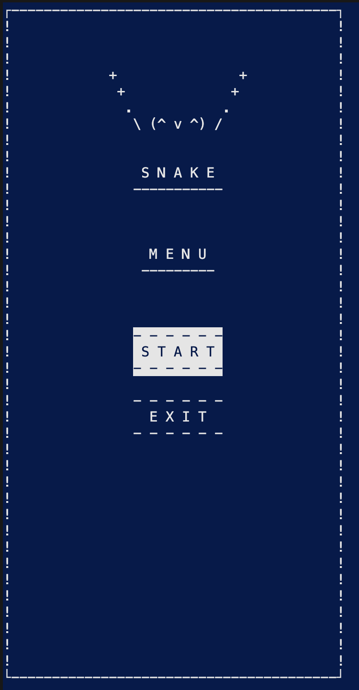
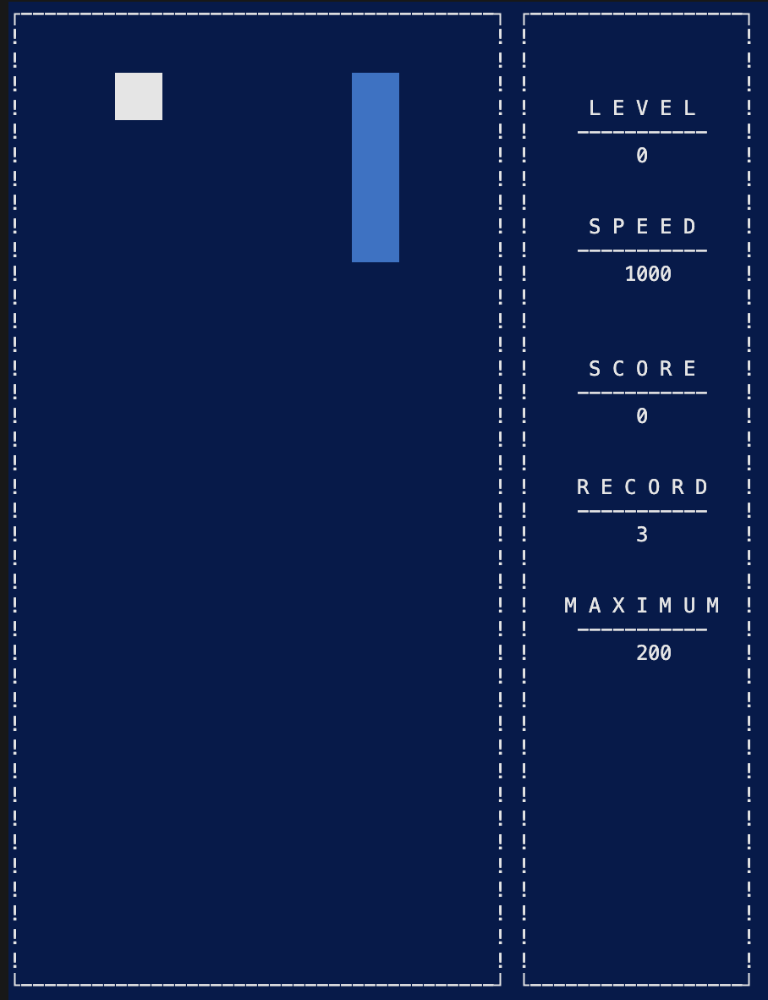
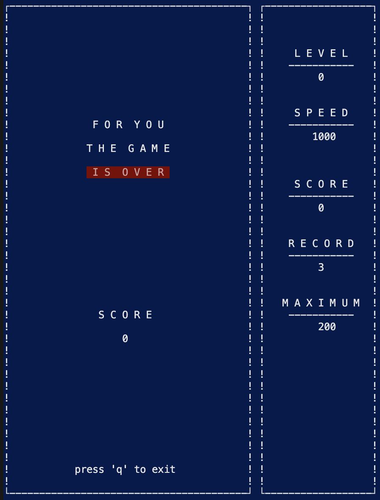
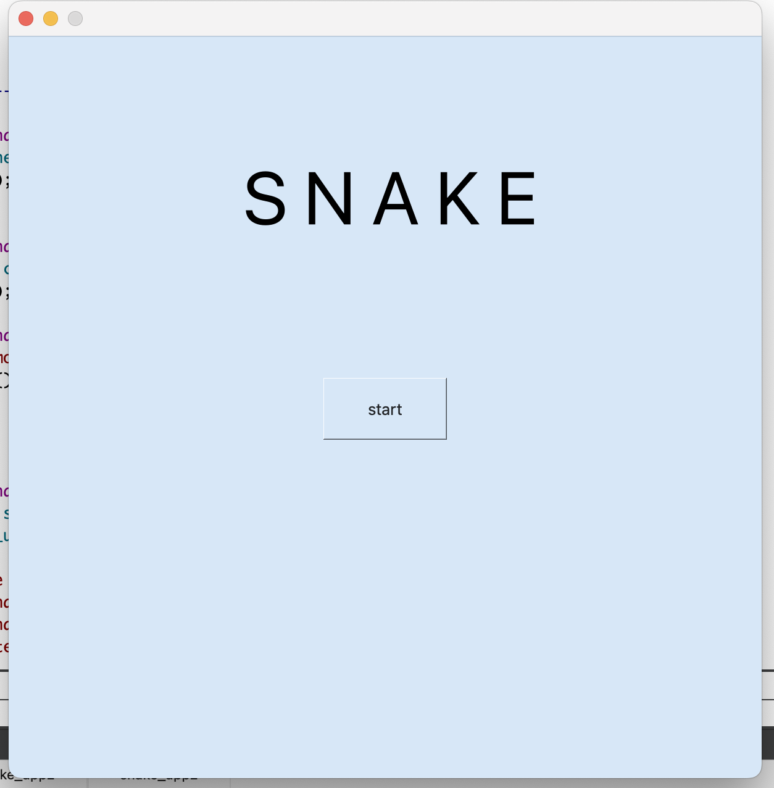
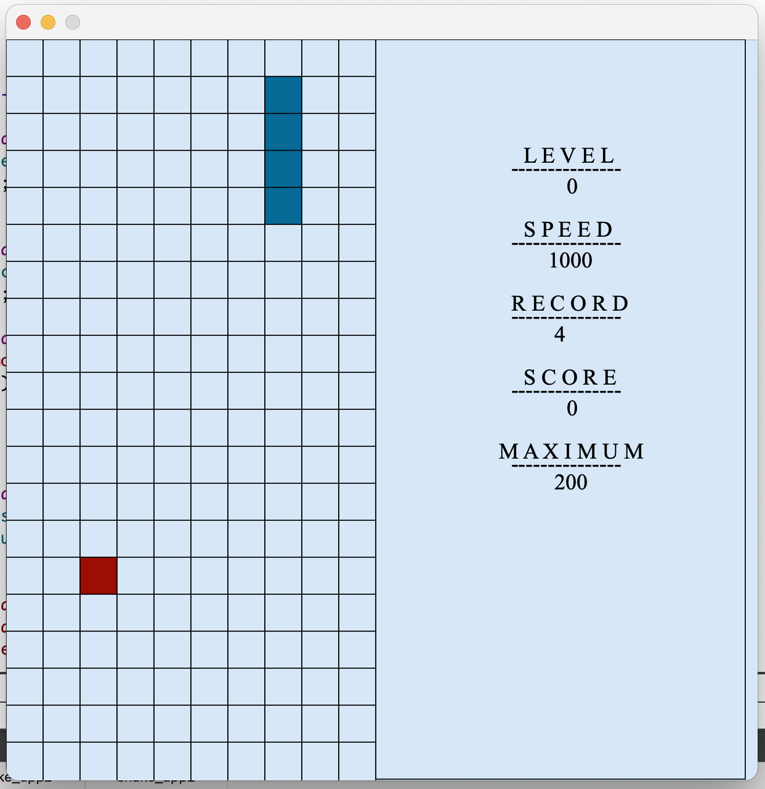
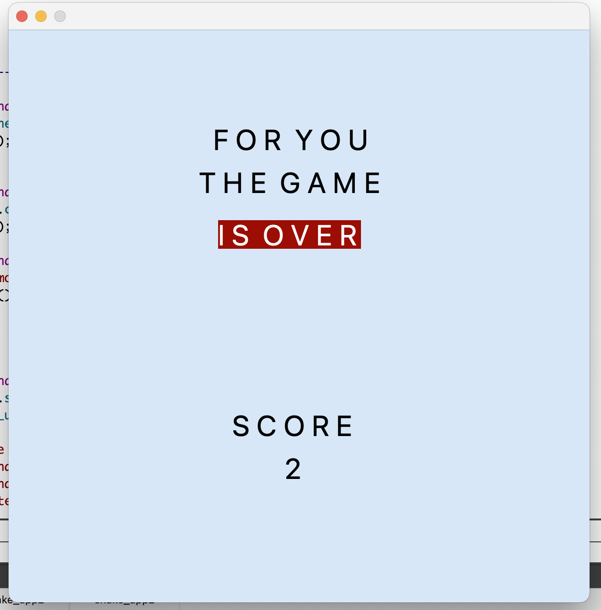

# Змейка
Реализация игры «Змейка» на языке программирования С++ в парадигме объектно-ориентированного программирования.

Проект состоит из двух отдельных компонентов: библиотеки, отвечающей за реализацию логики игры, и десктопного графического интерфейса.

Для формализации логики игры использованы конечные автоматы. 

## Содержание
- [Технологии](#технологии)
- [Использование](#использование)
- [Обзор паттернов MVC, MVP, MVVM](#обзор-паттерна-mvc-mvp-mvvm)
    - [Паттерн  MVC](#паттерн--mvc)
    - [Паттерн  MVP](#паттерн-mvp)
    - [Паттерн  MVVM](#паттерн-mvvm)
- [Разработка](#разработка)
- [Способ управления](#способ-управления)
    - [Terminal](#terminal)
    - [Desktop](#desktop)
- [Тестирование](#тестирование)

## Технологии
- C++ стандарта C++17
- компилятор gcc
- Makefile
- GTest
- lcov/gcov
- Google Style
- QT Creator version 6.2.
- ncurses

## Использование
1. Для установки проекта необходимо склонировать репозиторий `git@github.com:BalagurovaA/CPP_BrickGame_snake.git`, перейти в папку `./CPP_BrickGame_snake/src`

2. Скомпилировать и запустить проект: 
```sh
make install_snake
```
или 

```sh
make install_desktop
```
или 
```sh
make all
```
При вводе данной команды проект компилируется, запускаются тесты, открывается html страница, отображающая покрытие тестами, запускается игра в консольной версии, создается папка build в которой находится версия игры в формате desktop.

3. Запуск игры "змейка" в терминальной версии
```sh
make install_snake
make run_snake_console
```
4. Запуск unit-тестов
```sh
make test_snake
```
5. Отображение покрытия тестами через html страницу
```sh
make gcov_report_snake
```
6. Открыть документацию
```sh
make dvi_snake
```
7. Создать архив с папкой игры и приложением
```sh
make dist_snake
```
8. Подготовка кода  под clang-format Google Style
```sh
make fix_clang_snake
```
9. Проверка clang-format
```sh
make clang_snake
```
10. Очистка проекта
```sh
make clean_snake
```
или 
```sh
make clean_all
```
Данный проект также включает в себя реализацию игры тетрис, для компиляции игры тетрис, ознакомтесь с целями в Makefile

## Обзор паттернов MVC, MVP, MVVM: 

### Паттерн  MVC:

Паттерн MVC (Model-View-Controller, Модель-Представление-Контроллер) представляет из себя схему разделения модулей приложения на три отдельных макрокомпонента: модель, содержащую в себе бизнес-логику, представление — форму пользовательского интерфейса для осуществления взаимодействия с программой и контроллер, осуществляющий модификацию модели по действию пользователя.

Модель хранит и осуществляет доступ к основным данным, производит по запросам операции, определенные бизнес-логикой программы, то есть руководит той частью программы, которая отвечает за все алгоритмы и процессы обработки информации. Данные модели, изменяясь под действием контроллера, влияют на отображение информации на представлении пользовательского интерфейса. 

В качестве модели в данной программе выступает библиотека классов, осуществляющая логику игры змейка. Эта библиотека предоставляет все необходимые классы и методы для осуществления механики игры. 

Контроллер — тонкий макрокомпонент, который осуществляет модификацию модели. Через него формируются запросы на изменение модели. В коде это выглядит как некий «фасад» для модели, то есть набор методов, которые уже работают напрямую с моделью. Тонким он называется потому, что идеальный контроллер не содержит в себе никакой дополнительной логики, кроме вызова одного или нескольких методов модели. Контроллер выполняет функцию связующего элемента между интерфейсом и моделью. Это позволяет полностью инкапсулировать модель от отображения. Такое разделение полезно в силу того, что позволяет коду представления ничего не знать о коде модели и обращаться к одному лишь контроллеру, интерфейс предоставляемых функций которого, вероятно, не будет значительно меняться. Модель же может претерпевать значительные изменения, и, при «переезде» на другие алгоритмы, технологии или даже языки программирования в модели, потребуется поменять лишь небольшой участок кода в контроллере, непосредственно связанный с моделью. В противном случае, вероятнее всего, пришлось бы переписывать значительную часть кода интерфейса, так как он сильно зависел бы от реализации модели. Таким образом, взаимодействуя с интерфейсом, пользователь вызывает методы контроллера, которые модифицируют модель.

К представлению относится весь код, связанный с интерфейсом программы. В коде идеального интерфейса не должно быть никакой бизнес-логики. Он только представляет форму для взаимодействия с пользователем.

### Паттерн MVP

Паттерн MVP имеет два общих компонента с MVC: модель и представление. Но он заменяет контроллер на презентер.

Презентер реализует взаимодействие между моделью и представлением. Когда представление уведомляет презентер, что пользователь что-то сделал (например, нажал кнопку), презентер принимает решение об обновлении модели и синхронизирует все изменения между моделью и представлением. Однако презентер не общается с представлением напрямую. Вместо этого он общается через интерфейс. Благодаря чему все компоненты приложения впоследствии могут быть протестированы по отдельности.

### Паттерн MVVM

MVVM — это более современная эволюция MVC. Основная цель MVVM — обеспечить четкое разделение между уровнями представления и модели.

MVVM поддерживает двустороннюю привязку данных между компонентами View и ViewModel.

Представление выступает подписчиком на события изменения значений свойств предоставляемых моделью представления (ViewModel). В случае, если в модели представления изменилось какое-либо свойство, то она оповещает всех подписчиков об этом, и представление, в свою очередь, запрашивает обновлённое значение свойства из модели представления. В случае если пользователь воздействует на какой-либо элемент интерфейса, представление вызывает соответствующую команду, предоставленную моделью представления.

Модель представления — с одной стороны, абстракция представления, а с другой — обертка данных из модели, подлежащих связыванию. То есть она содержит модель, преобразованную к представлению, а также команды, которыми может пользоваться представление, чтобы влиять на модель.

## Разработка

### Требования
- `gcc`
- `make`
- `gcov/lcov`
- `GTest`
- `ncurses`
-----------------

- Программа разработана на языке C++ стандарта C++17.
- Программа состоит из двух частей: библиотеки, реализующей логику игры змейка, и десктопного интерфейса.
- Для формализации логики игры использован конечный автомат.
- Код библиотеки находится в папке src/brick_game/snake;
- Код с интерфейсом программы находится в папке src/gui/desktop;
- Реализация придерживается Google Style;
- Классы реализованы внутри пространства имен `s21`;
- Установка ведется в произвольный каталог `build`;
- Реализация с графическим пользовательским интерфейсом, на базе `QT`;
- Программа реализована с использованием паттерна MVC;

## Способ управления 

- Игровое поле — десять «пикселей» в ширину и двадцать «пикселей» в высоту.

<br> 

### Terminal: 
1. После запуска открывается меню в котором можно выбрать переход к следующим окнам
- START -> переход к игре
- EXIT  -> выход из игры, нажмите Enter, после этого нажмите 'q'
<br> 

2. После кнопки старт у программы присутствует управление:

Изначально голова змейки "смотрит" вниз, начинайте игру с кнопок вниз/вправо/влево

- Стрелка вверх : `движение вверх`
- Стрелка вниз: `движение вниз`
- Стрелка вправо: `движение вправо`
- Стрелка влево: `движение влево`
- Удержание стрелки вниз: `ускорение`
- Кнопка 'p':  `пауза`

<br> 

Внимание!
Изначально голова змейки "смотрит" вниз, начинайте игру с кнопок вниз/вправо/влево

3. После нажатия кнопки пауза октывается окно паузы с возможностью продолжить игру и с возможностью выхода из игры. После выхода из игры нужно нажать кнопку Enter и откроется окно final.


<br> 
<br> 

4. Боковая панель
При старте игры справа возникает боковая панель на которой изображены: уровень, рекорд, скорость для возможного мониторинга процесса игры 

5. В игре присутствует начисление очков и установление рекорда.
Начисление очков происходит следующим образом:

- 1 "яблоко" — 1 очко;

Каждые заработанные 5 очков увеличивают уровень.
- Максимальное количество оков - 50
- Максимальный уровень - 10

6. Управление возможно только при английской раскладке клавиатуры.

### Desktop

<br> 

<br> 

<br> 

## Тестирование
- Присутствует полное покрытие unit-тестами функций библиотеки c помощью библиотеки `Gtest`
- Unit-тесты проверяют результаты работы реализации всей backend-части змейки, которая релизована в модели
- Unit-тесты покрывают около 90% каждой функции

### Причина разработки данного проекта
Учебное задание в Школе 21 от Сбера