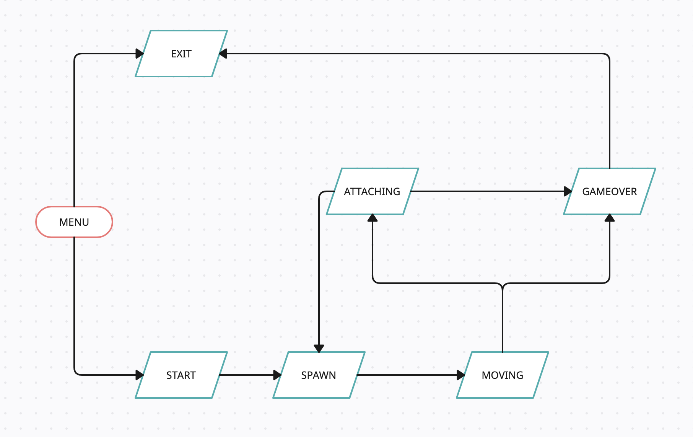
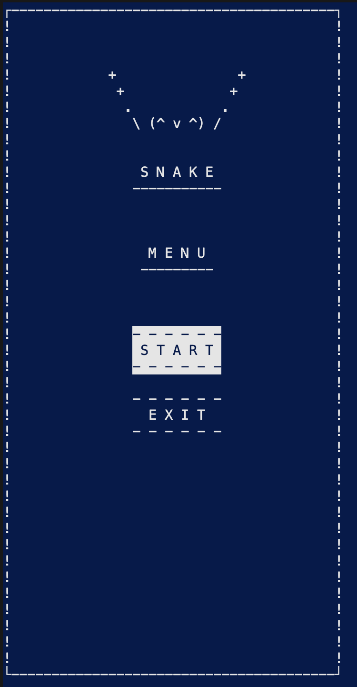
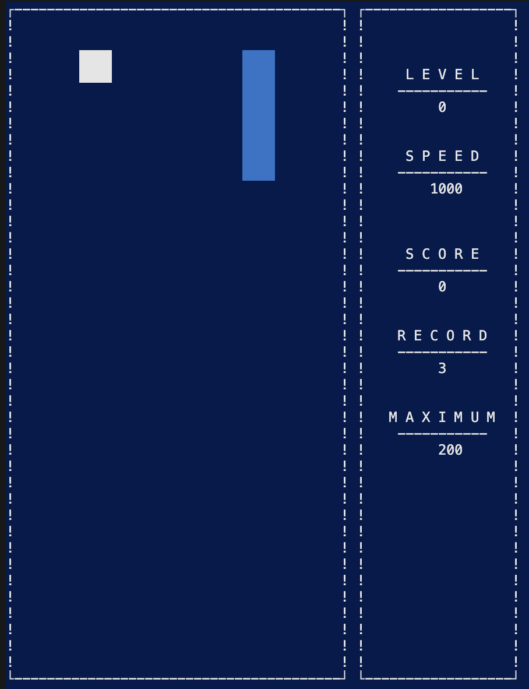
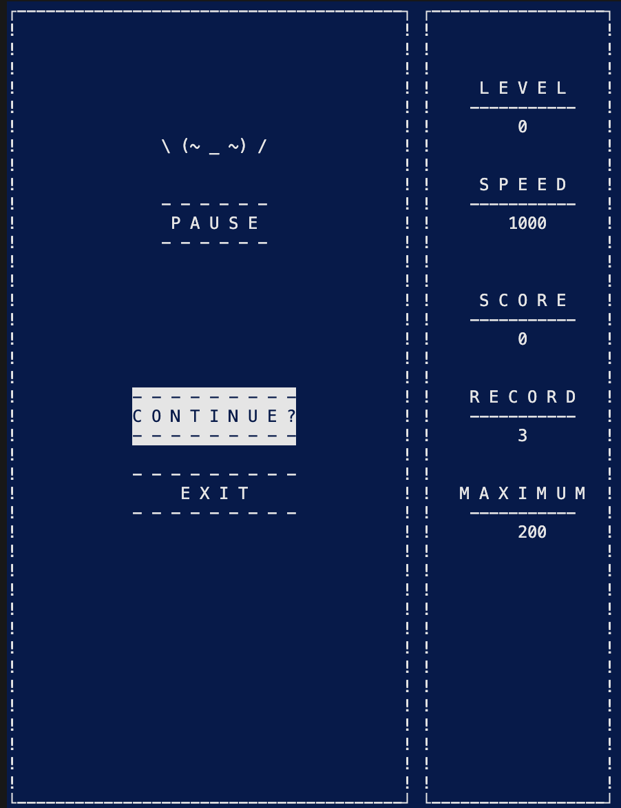
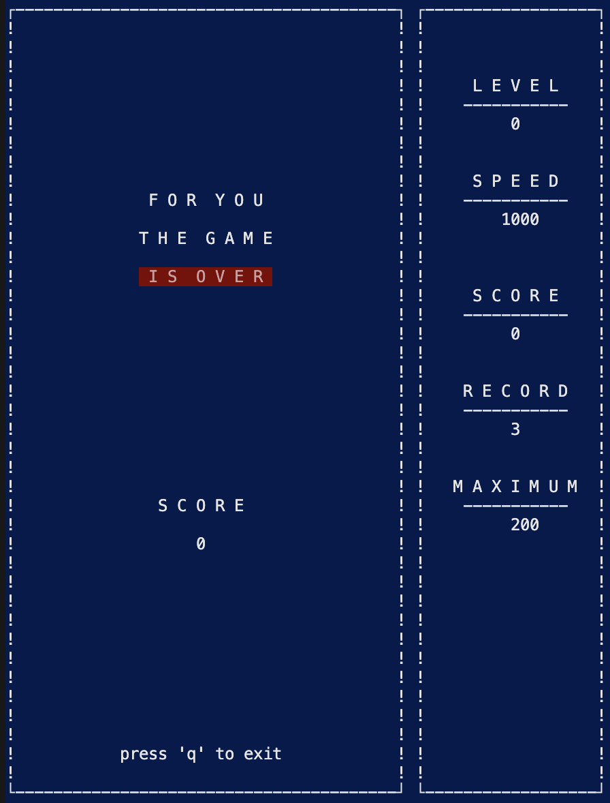
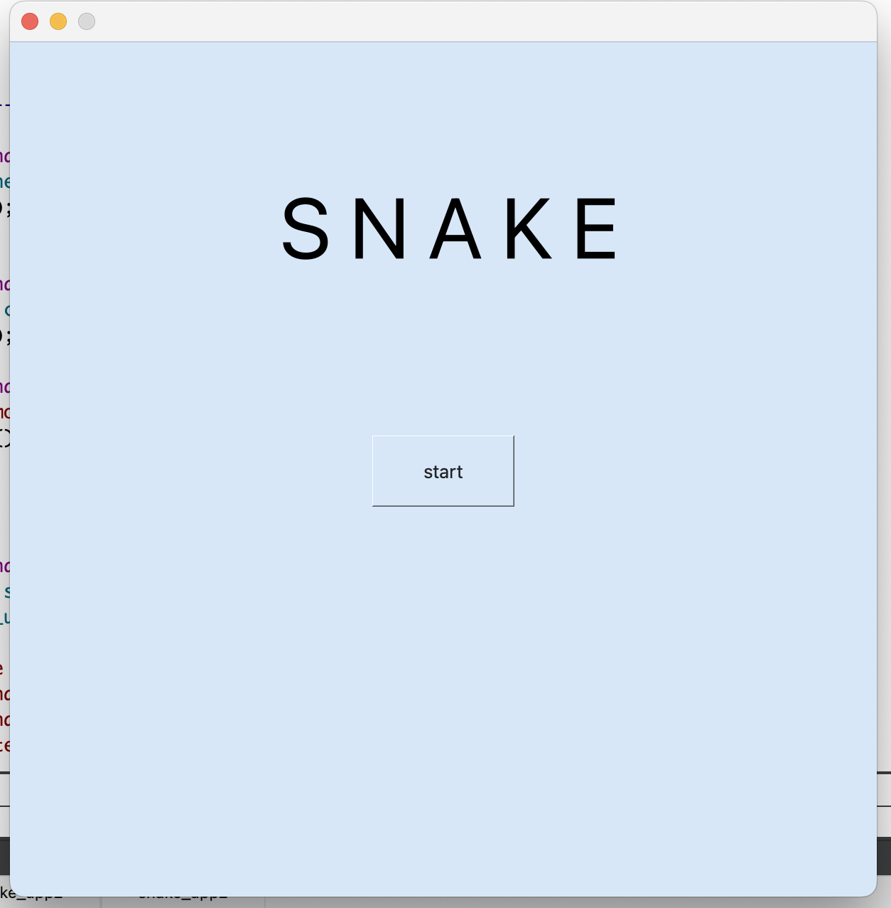
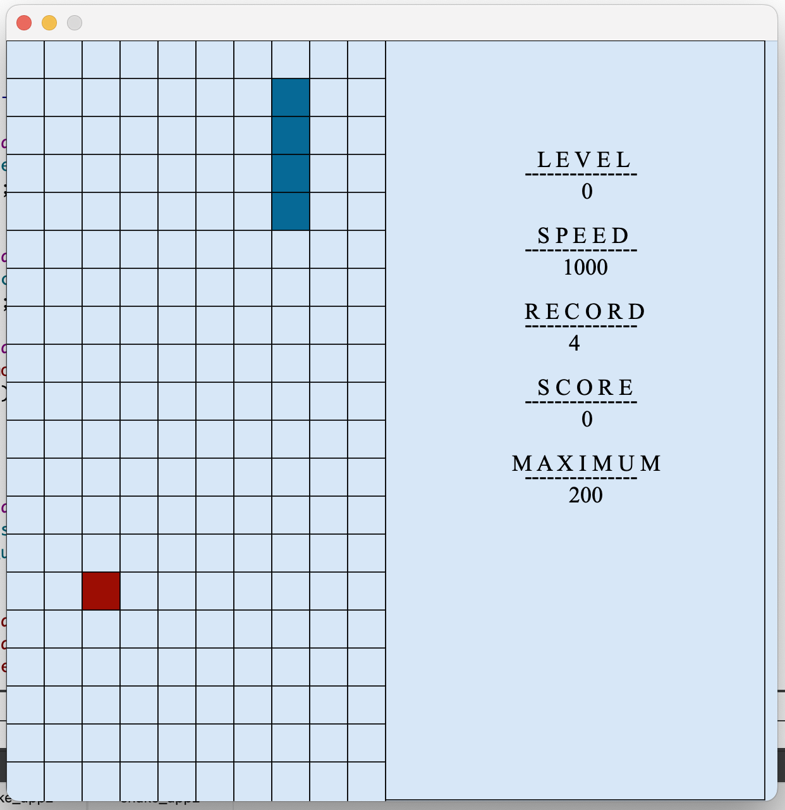
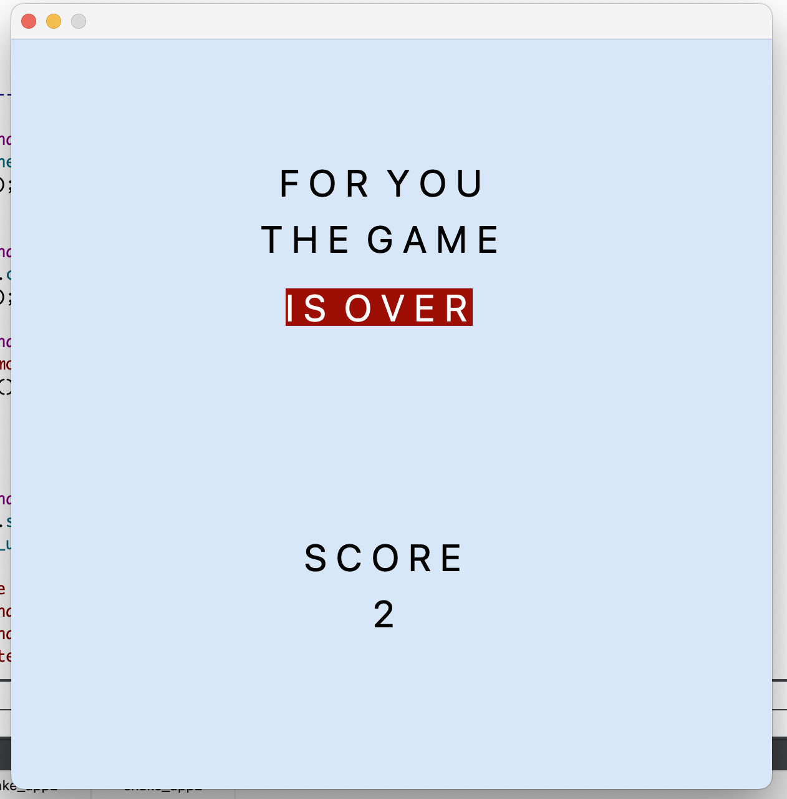

## Змейка
## Установка и запуск
Для запуска программы необходимо:
- склонировать репозиторий
- перейти в папку src
- выполнить команду make install_run

## Part 1
- Программа разработана на языке C++ стандарта C++17
- Программа состоит из двух частей: библиотеки, реализующей логику игры змейка, и десктопного интерфейса.
- Для формализации логики игры использован конечный автомат.
- Программа реализована по принципу MVC
- Сборка программы настроена с помощью Makefile со стандартным набором целей для GNU-программ: all, install, uninstall, clean, dvi, dist, tests. 
- Реализация с графическим пользовательским интерфейсом, на базе одной из GUI-библиотеки с API для C++17 QT Creator version 6.2.
- Программа покрыта unit-тестами c помощью библиотеки GTest

- Игровое поле — десять «пикселей» в ширину и двадцать «пикселей» в высоту.

  
## Part 2 Способ управления 

Терминал: 
1. После запуска открывается меню в котором можно выбрать переход к следующим окнам
- START -> переход к игре
- EXIT  -> выход из игры, нажмите Enter, после этого нажмите 'q'
  

2. После кнопки старт у программы присутствует управление:

Изначально голова змейки "смотрит" вниз, начинайте игру с кнопок вниз/вправо/влево

- Стрелка вверх : `движение вверх`
- Стрелка вниз: `движение вниз`
- Стрелка вправо: `движение вправо`
- Стрелка влево: `движение влево`
- Удержание стрелки вниз: `ускорение`
- Кнопка 'p':  `пауза`

  

Внимание!
Изначально голова змейки "смотрит" вниз, начинайте игру с кнопок вниз/вправо/влево

3. После нажатия кнопки пауза октывается окно паузы с возможностью продолжить игру и с возможностью выхода из игры. После выхода из игры нужно нажать кнопку Enter и откроется окно final.

  
  

4. Боковая панель
При старте игры справа возникает боковая панель на которой изображены: уровень, рекорд, скорость для возможного мониторинга процесса игры 

5. В игре присутствует начисление очков и установление рекорда.
Начисление очков происходит следующим образом:

- 1 "яблоко" — 1 очко;

Каждые заработанные 5 очков увеличивают уровень.
- Максимальное количество оков - 50
- Максимальный уровень - 10

6. Управление возможно только при английской раскладке клавиатуры.

## Part 3 Desktop Version

  

  

  

Удачи в игре!